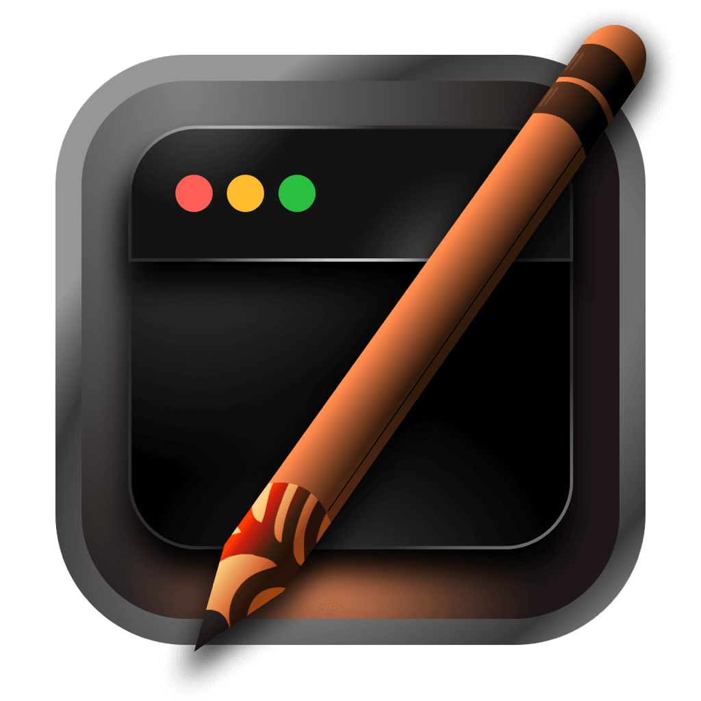

# Alter

[](https://github.com/hitblast/Alter/actions/workflows/build.yml)

Beautiful app to customize your macOS app icons with ease. <br>
Works on **macOS Ventura 13 or newer.**

> [!NOTE]
> This project is still under active development. Expect breaking changes till v1. See "Project Status" for reference.

## Table of Contents

- [Key Features](#key-features)
- [Installation](#installation)
- [Project Status](#project-status)
- [Common Pitfalls](#common-pitfalls)
- [Backstory](#backstory)
- [License](#license)

## Key Features

- [Simple workflow]() for changing regular app icons
- Beautiful UI with low overhead using [Flutter](https://flutter.dev/)
- Both [.png (work-in-progress)]() and [.icns]() usable as valid formats for icons
- Doesn't require disabling SIP (System Integrity Protection)
- Continuous and managed app synchronization in the background
- Icon modification using application-default attributes

## Installation

> [!IMPORTANT]
> ⚠️ This section is still a work-in-progress. Installation methods will only work after the initial release.

📦 Install Alter using [Homebrew](https://brew.sh/) **(Recommended)**:

```
brew install --cask hitblast/tap/alter
```

Alternatively, use [GitHub Releases](https://github.com/hitblast/alter/releases) to download the latest builds.

> [!NOTE]
> By using Alter, you acknowledge that Alter is not [notarized.](https://developer.apple.com/documentation/security/notarizing_macos_software_before_distribution)
>
> It's a security feature of Apple, based on which binaries are validated before running on consumer hardware. Since I do not plan to notarize Alter, the [Homebrew installation script]() will automatically remove the `com.apple.quarantine` attribute upon installation.
>
> A better reference could be found for this concept and why invalidating the attribute is important in [this section](https://developer.apple.com/documentation/security/notarizing_macos_software_before_distribution) of the documentation nikitabobko wrote for AeroSpace.

## Project Status

This project is still under active development. Before the release of v1, some important tasks need to be filled up such as:

- [ ] Improved integrity checks for each app.
- [ ] Taking ["Common Pitfalls"](#common-pitfalls) into account - try and resolve the ongoing conflicts with some apps.
- [ ] Integration of standard image formats such as JPG and PNG.

## Common Pitfalls

Based on common analysis of the project, a few issues have been found for this type of project on Macs:

- Self-validating binaries like [Discord](https://discord.com/) do not cooperate with the attribute
modifications happening inside, and could very as well broken once they're
customized. To solve this, I've tried incorporating a [blacklist feature]() for
apps which shouldn't be modified at all.

- The [Flutter Engine](https://github.com/flutter/engine) is a part of the
compiled binary (obviously since it's a Flutter project), so it will not be *as
memory-efficient* as it would've been if I had used something like SwiftUI. It's
not really a pitfall, rather something to note when programming on Alter.

- Large apps like IDEs such as [Android Studio](https://developer.android.com/studio) tend to
check for file integrity before updating instead of entirely replacing the
binary due to their sheer size. These might cause some issues for Alter, so it's
best suggested to remove the icon and reapply after completing the update
procedure.

## Backstory
As an ex-Linux and ex-Windows user, customizability was at the forefront of what
I was doing with my laptop back when I started learning. However, when I
switched to my Apple Silicon-powered machine, I wasn't really sure how to take
"customizability" like I used to. Sure, there are apps like
[AeroSpace](https://github.com/nikitabobko/AeroSpace), [Karabiner
Elements](https://karabiner-elements.pqrs.org/) and
[Raycast](https://www.raycast.com/) which help me power through my everyday
workflow now, but aside of keybindings and shortcuts, I also wanted my Mac to
look and feel just like how I want it to.

I eventually came across
[IconChamp](https://www.macenhance.com/iconchamp.html)
and [Pictogram](https://pictogramapp.com/), and while the latter one allows me
to easily change "some" of my app icons, IconChamp can change basically all of
them. Including, obviously, system icons. The problem? None of them are really
"open-source" and not "really stable" either, according to [this Reddit
thread](https://www.reddit.com/r/macapps/comments/1dm1uad/has_iconchamp_been_abandoned/)
which describes IconChamp glitching out while changing system icons on a regular
basis.

I wanted to take the good parts of both apps and make my own, personal solution
with a fully open-sourced near-native development experience.

## License

This project has been licensed under the [MIT License](./LICENSE).
