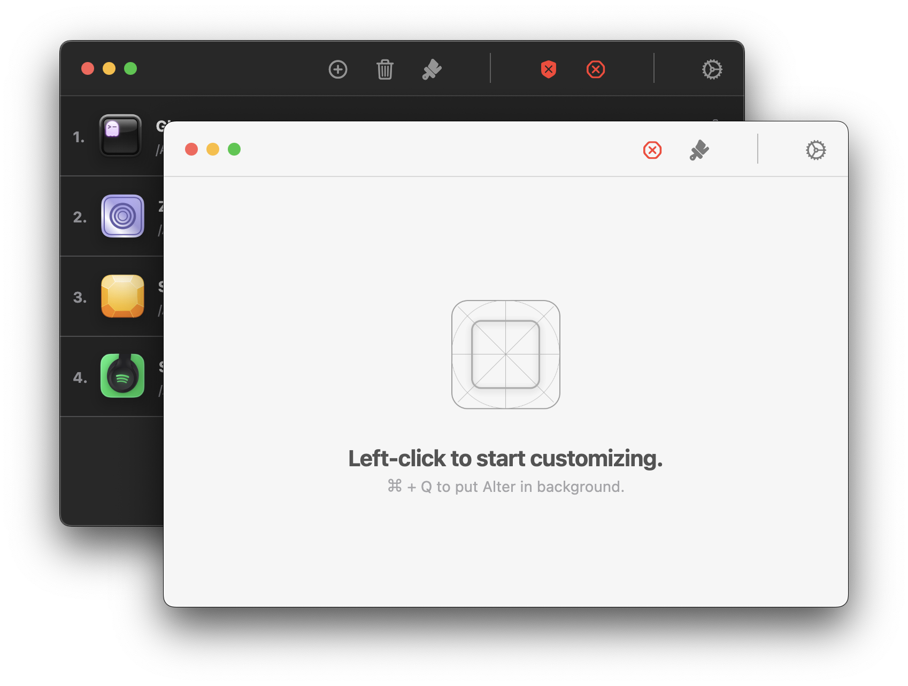

# Alter

[](https://github.com/hitblast/Alter/actions/workflows/static.yml)

A minimal app to customize your macOS app icons with ease. <br>
Works on **macOS Ventura 13 or newer.**

## Table of Contents

- [Installation](#installation)
- [Key Features](#key-features)
- [Screenshots](#screenshots)
- [Backstory](#backstory)
- [Common Pitfalls](#common-pitfalls)
- [Troubleshooting](#troubleshooting)
- [Contributing](#contributing)
- [License](#license)

## Installation

🍺 Install Alter using [Homebrew](https://brew.sh/) **(Recommended)**:

```bash
brew install --cask hitblast/tap/alter
```

> [!IMPORTANT]
> Make sure the app has access to **Privacy & Security > App Management** permission so that it can operate as usual.

Alternatively, use [GitHub Releases](https://github.com/hitblast/alter/releases) to download the latest builds.

> [!NOTE]
> By using Alter, you acknowledge that Alter is not [notarized.](https://developer.apple.com/documentation/security/notarizing_macos_software_before_distribution)
>
> It's a security feature of Apple, based on which binaries are validated before running on consumer hardware. Since I do not plan to notarize Alter, the [Homebrew installation script]() will automatically remove the `com.apple.quarantine` attribute upon installation.
>
> A better reference could be found for this concept and why invalidating the attribute is important in [this section](https://developer.apple.com/documentation/security/notarizing_macos_software_before_distribution) of the documentation nikitabobko wrote for AeroSpace.

## Key Features

- Simple workflow for changing regular app icons
- Doesn't require disabling [SIP (System Integrity Protection)]()
- Continuous and managed app synchronization in the background
- Small binary size (19 MiB when compressed)
- Based on the [Flutter](https://flutter.dev/) framework

## Screenshots

<div align="center">
    
    <br>
    <i>The icons show in the image are available on <a href="https://macosicons.com/">macosicons.com</a></i>
    <br>
</div>

## Backstory
I come from a Linux and Windows background, and customizability was at the forefront of what
I was doing with my laptop back when I started learning. However, when I
switched to my Apple Silicon-powered machine, I wasn't really sure how to take
"customizability" like I used to. Sure, there are apps which help me power through my everyday
workflow now, but aside of keybindings and shortcuts, I also wanted my Mac to
look and feel just like how I want it to.

I eventually came across
[IconChamp](https://www.macenhance.com/iconchamp.html)
and [Pictogram](https://pictogramapp.com/), and while the latter one allows me
to easily change "some" of my app icons, IconChamp can change basically all of
them. Including, obviously, system icons. The problem? None of them are really
"open-source" and not "really stable" either, according to [this Reddit
thread](https://www.reddit.com/r/macapps/comments/1dm1uad/has_iconchamp_been_abandoned/)
which describes IconChamp glitching out while changing system icons on a regular
basis.

I wanted to take the good parts of both apps and make my own, personal solution
with a fully open-sourced near-native development experience.

---

## Common Pitfalls

Based on basic analysis of the project, a few, possibly resolvable issues have been found so far:

- Self-validating binaries like [Discord](https://discord.com/) do not cooperate with the attribute
modifications happening inside, and could very as well broken once they're
customized. To solve this, I've tried incorporating a blacklist of
apps which should be prohibited from modifying unless the user really desires.

- The [Flutter Engine](https://github.com/flutter/engine) is a part of the
compiled binary (obviously since it's a Flutter project), so there will always be a tiny difference in size when it comes to comparing with a Swift binary.

- For now, Alter cannot modify the system apps on macOS due to SIP (System Integrity Protection) being a thing. I'm still working on possible workarounds.

## Contributing

Contributions are always welcome. If you are a developer who is willing to improve *any* aspect of the application,
consider reading [dev-docs/DEVELOPMENT.md](/dev-docs/DEVELOPMENT.md) for everything related to
reproducing the development environment and more. If you have already attached the development environment, however,
consider following through the ethical guidelines of contributing written in [CONTRIBUTING.md](/CONTRIBUTING.md).

## License

This project has been licensed under the [MIT License](./LICENSE).
