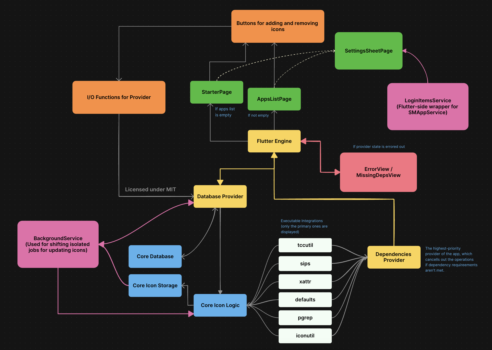

# Developer's Guide

This guide walks you through the setup and development process for contributing to Alter.

## Table of Contents

- [Prerequisites](#prerequisites)
- [Code Editor](#code-editor)
- [Setup](#setup)
- [Project Anatomy](#project-anatomy)
- [Formatting](#formatting)

## Prerequisites

- [Flutter SDK](https://flutter.dev/docs/get-started/install) (latest)
- [mise](https://mise.jdx.dev) (**optional**, latest)
- [CocoaPods](https://cocoapods.org) (optional, latest) [as a part of the Flutter dependency chain]

## Code Editor

You can use any code editor for following along the guide. I have personally used [Zed](https://zed.dev) for this
particular setup. If you're using Zed, this gives you a few benefits since the configuration files have been
bundled with this repository:

  - Low memory overhead while debugging Alter (excluding Flutter).
  - [Spawning tasks](https://zed.dev/docs/tasks) for building a production release instead of depending on `mise`/`flutter` directly.

## Setup

- Step 1: Clone the repository.

```bash
# HTTPS
git clone https://github.com/hitblast/Alter.git

# SSH
git clone git@github.com:hitblast/Alter.git

# Enter the directory.
cd Alter
```

- Step 2: Install the dependencies.

  i. With `mise` (recommended):

  ```bash
  mise install && flutter pub get
  ```

  ii. Without `mise`:

  ```bash
  # Install Flutter SDK for your platform separately.
  flutter pub get
  ```

  You'll also have to ensure that the dependencies from the `Podfile` (located inside `macos/`) are installed. To do that, simply run `pod install` inside the mentioned directory.

- Step 3: Setup Xcode development certificates (you must attach an Apple account with your Xcode instance and choose a certificate for buildign the app).

- Step 4 **(Optional)**: If you have `sccache` installed, you must note that the current configuration for this project doesn't allow for the builds to succeed with cache-optimized clang configuration. You must disable it beforehand:

```bash
export CC="clang" && export CXX="clang++"
```

- Step 5: Finally, build a production release for Alter.

```bash
mise run build
# this is the same as running: flutter build macos --verbose --release --tree-shake-icons
```

## Project Anatomy



## Formatting

This project uses traditional Dart code formatting principles for the entire codebase. If you are a developer
who is working on any concurrent issue/task on Alter, integrate your changes by executing:

```bash
dart format .
```

This project also uses the following development dependencies for additional linting support.
Refer to the [pubspec.yaml](../pubspec.yaml) file for more information:

- `flutter_lints`
- `custom_lint`
- `riverpod_lint`
